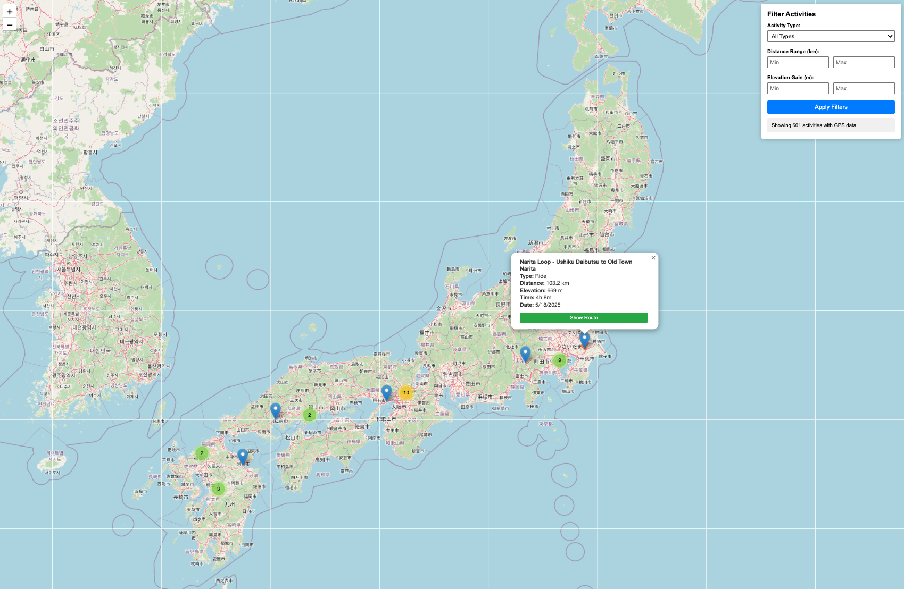

# slipstream

Cycling data analysis and ingestion tooling for Strava performance data.

> **Note**: This project is being developed with significant contributions from Claude (Anthropic's AI assistant). Much of the codebase architecture, refactoring, and tooling setup has been collaboratively designed and implemented with AI assistance.

## Goal

Analyze cycling performance data to detect fatigue patterns and improve FTP (Functional Threshold Power) and pacing strategy.

## Current Status

**Phase 0: Authentication & Data Ingestion** ✅ Complete

Successfully ingested and stored historical Strava data:

```bash
$ poetry run python scripts/cli.py stats
============================================================
ACTIVITY SUMMARY STATISTICS
============================================================

Total Activities: 1,126
Date Range: 2024-01-02T02:02:22Z to 2025-12-31T05:21:40Z

Total Distance: 15,404.3 km
Total Time: 965.6 hours
Total Elevation: 157,992.8 m

Activities by Type:
  Ride: 634
  WeightTraining: 198
  Run: 156
  Walk: 38
  RockClimbing: 29
  Workout: 24
  VirtualRide: 21
  Hike: 19
  Swim: 4
  Rowing: 2
  EBikeRide: 1

Activities by Year:
  2025: 415
  2024: 711
```

**Data stored:** 1,125 activities (90 MB) in Parquet format with full stream data (HR, power, cadence, GPS, altitude, etc.)

## Web Map Viewer

Interactive web application for visualizing activities on a map with clustering and filtering.



**Features:**
- 🗺️ Interactive map with 601 GPS-enabled activities
- 📍 Yelp-style marker clustering that splits on zoom
- 🔍 Filter by activity type, distance range, and elevation gain
- 🛣️ Click markers to view activity details
- 🎨 Color-coded route visualization by activity type
- ⚡ Fast querying with DuckDB backend

**Start the web viewer:**
```bash
poetry run python scripts/cli.py web
# Open http://localhost:8080 in your browser
```

**Usage:**
- Use the filter panel on the right to narrow down activities
- Click on map markers to see activity details
- Click "Show Route" to display the full GPS track
- Zoom in/out to see clusters split into individual activities

## Future Phases

- **Phase 1**: Data exploration and validation (DuckDB queries, summary statistics, data quality checks)
- **Phase 2**: Batch analysis with Spark to identify fatigue patterns and pacing strategies
- **Phase 3**: Real-time stream processing with Flink for live workout guidance
- **Phase 4**: Enhanced analytics with sleep, nutrition, and training load context

## Getting Started

See [SETUP.md](SETUP.md) for complete installation and usage instructions.

Quick start:
```bash
poetry install
poetry run python scripts/cli.py auth-start
# Follow authentication steps in SETUP.md
poetry run python scripts/cli.py backfill-activities
poetry run python scripts/cli.py stats
```
